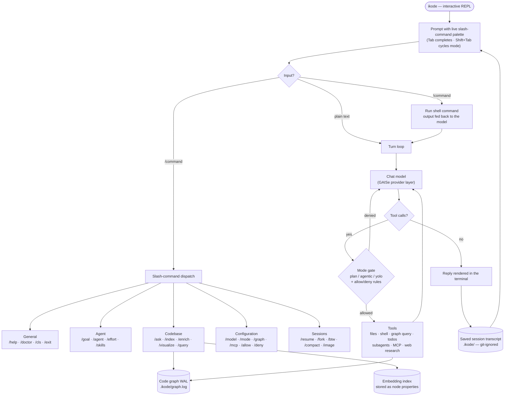

# iKode Wiki

> **⚠️ Keep this wiki up to date.** The single source of truth for the command set is the
> `COMMANDS` registry in [`ikode-cli/src/palette.rs`](../ikode-cli/src/palette.rs) — the palette,
> `/help`, and this wiki must never drift apart. **Whenever a command is added, renamed, or its
> behaviour changes, update its page under [commands/](commands/README.md) and the index below
> in the same change.** Configuration and MCP changes belong in
> [configuration.md](configuration.md) and [mcp.md](mcp.md).
>
> Last reviewed: 01/08/2026

---

## What is iKode?

iKode is an **agentic coding CLI** for browsing, editing, and reasoning over code and Markdown
with a **graph-backed index**. It supports interactive and one-shot work, persisted sessions and
goals, provider-independent chat/embeddings, and a local code-map visualiser.

Key design principles:

- **Algorithmic first, inference second** — indexing, graph traversal, and retrieval are
  deterministic and local; LLM calls are opt-in, capped, and hash-gated.
- **Provider-independent** — chat, summary, embedding, and web-research models are all
  independently switchable ([/model](commands/model.md), [/smodel](commands/smodel.md),
  [/emodel](commands/emodel.md), [/wmodel](commands/wmodel.md)) across OpenAI, Anthropic,
  Gemini, Bedrock, Vertex AI, and local Ollama.
- **Durable by construction** — the code graph lives in a single-writer, checksummed WAL
  (`.ikode/graph.log`); sessions, goals, and settings are written atomically.
- **Permission-gated autonomy** — three operating modes (`plan` / `agentic` / `yolo`)
  structurally control what the model may do, with persistent
  [/allow](commands/allow.md) / [/deny](commands/deny.md) rules on top.

## Repository layout

| Path | What it is |
| --- | --- |
| [`ikode-cli/`](../ikode-cli) | The CLI binary: REPL, command palette, turn loop, tools, sessions, goals, visualiser |
| [`modules/gaise/`](../modules/gaise) | GAISe — the provider-abstraction layer (chat, embeddings, streaming, tools) as a nested workspace |
| [`modules/livec_graph/`](../modules/livec_graph) | LivingVector graph engine backing the code index (vendored, standalone crate) |
| [`docs/`](../docs) | Deep-dive design docs (tools, WAL, MCP, goals, effort/agents) |
| [`wiki/`](.) | This wiki — project write-up, [command reference](commands/README.md), [configuration](configuration.md) and [MCP](mcp.md) guides |

## How a session flows

The chart below shows the life of one interactive session — from keystroke to model turn to
graph and disk. (GitHub renders this natively; edit the ` ```mermaid ` block in this file.)



A few flows sit outside the main loop:

- **Goals** ([/goal](commands/goal.md)) are persisted objectives the harness drives
  autonomously across many turns, each with its own history, mode, effort, and cache lane.
- **Subagent threads** ([/agent](commands/agent.md)) are session-scoped, read-only parallel
  workers reporting back to the lead.
- **Side chats** ([/btw](commands/btw.md)) answer a question in an ephemeral read-only branch
  that never touches the main transcript.

## Quick start

```bash
cargo install --path ikode-cli   # install
ikode init                       # create .ikode/config.toml and .ikode/ikode.md
ikode                            # start the interactive REPL
```

Then, inside the REPL:

```text
/init            # one-shot index + summary + embedding warm-up
/ask how does the WAL recover from a torn write?
/visualize       # serve the interactive code map in the browser
```

Provider credentials come from the environment or `.env` / `.ikode/.env` — see the
[configuration guide](configuration.md) for every variable and the layering rules. Check them
with [/vars](commands/vars.md) and diagnose setup with [/doctor](commands/doctor.md).

### Run modes (one-shot flags)

```bash
ikode --prompt "do X"              # one-shot run
ikode --model  "provider::model"   # select the chat model
ikode --effort low|medium|high|max|ultra
ikode --continue                   # resume the latest saved session
ikode --resume <id>                # resume a specific session
ikode --no-index                   # skip startup indexing/sync prompts
ikode --no-graph                   # traditional harness, no graph tools
ikode --brave                      # yolo mode for this session
```

## Slash-command index

Every command has its own page under [commands/](commands/README.md) with usage, technical
detail on how it operates, and worked use cases. Categories match the `/help` output.

### General

| Command | Summary |
| --- | --- |
| [/help](commands/help.md) | Display the command reference |
| [/doctor](commands/doctor.md) | Check providers, configuration, graph and session storage |
| [/cls](commands/cls.md) | Clear the terminal |
| [/exit](commands/exit.md) | Quit the interactive session |
| [`!<command>`](commands/shell.md) | Run a shell command and feed its output to the model |

### Agent

| Command | Summary |
| --- | --- |
| [/goal](commands/goal.md) | Start, resume, steer, switch, or close an autonomous goal |
| [/goals](commands/goals.md) | List all goal tasks and statuses |
| [/agent](commands/agent.md) | Spawn and control parallel subagent threads |
| [/agents](commands/agents.md) | List subagent threads and statuses (alias: [/tasks](commands/tasks.md)) |
| [/effort](commands/effort.md) | Show or set reasoning and delegation effort |
| [/skills](commands/skills.md) | List, run, or manage project skills |

### Codebase

| Command | Summary |
| --- | --- |
| [/ask](commands/ask.md) | Answer from retrieved code with LLM synthesis |
| [/ask-codebase](commands/ask-codebase.md) | Show raw relevant chunks and connectivity |
| [/index](commands/index.md) | Build or refresh the code and Markdown index (alias: [/scan](commands/scan.md)) |
| [/init](commands/init.md) | One-shot index, summary and embedding warm-up |
| [/enrich](commands/enrich.md) | Run summary then embedding passes |
| [/summarize](commands/summarize.md) | Summarise chunks through the summary model |
| [/embed](commands/embed.md) | Build the semantic embedding index |
| [/architecture](commands/architecture.md) | Generate a prose codebase overview |
| [/relationships](commands/relationships.md) | Describe graph relationships |
| [/dir-summaries](commands/dir-summaries.md) | Roll up one summary per directory |
| [/query](commands/query.md) | Run a structured start/traverse/where graph query |
| [/visualize](commands/visualize.md) | Serve the interactive code map |
| [/rebuild](commands/rebuild.md) | Wipe and rebuild derived graph data |
| [/squash](commands/squash.md) | Checkpoint exact graph state and discard WAL history |

### Configuration

| Command | Summary |
| --- | --- |
| [/mode](commands/mode.md) | Show or persist the operating mode (plan/agentic/yolo) |
| [/model](commands/model.md) | Show or switch the chat model |
| [/smodel](commands/smodel.md) | Show or switch the summary model |
| [/emodel](commands/emodel.md) | Show or switch the embedding model |
| [/wmodel](commands/wmodel.md) | Show or switch the web-research agent model |
| [/graph](commands/graph.md) | Show, switch, or persist graph/index mode |
| [/mcp](commands/mcp.md) | Register and manage third-party MCP servers |
| [/allow](commands/allow.md) | Manage persistent permission allow rules |
| [/deny](commands/deny.md) | Manage persistent permission deny rules |
| [/vars](commands/vars.md) | List iKode-related environment variables (keys masked) |

### Sessions

| Command | Summary |
| --- | --- |
| [/btw](commands/btw.md) | Ask in an ephemeral read-only side chat |
| [/fork](commands/fork.md) | Clone this chat into a fresh saved branch |
| [/resume](commands/resume.md) | Pick and resume a saved session |
| [/clear](commands/clear.md) | Reset history and begin a new saved session |
| [/compact](commands/compact.md) | Summarise older turns to shrink context |
| [/history](commands/history.md) | Show history, token, transcript and byte statistics |
| [/storage](commands/storage.md) | Show graph WAL and saved-session storage usage |
| [/sessions](commands/sessions.md) | Inspect or safely prune saved transcripts |
| [/max-history](commands/max-history.md) | Set or persist the request history limit |
| [/prefix-keep](commands/prefix-keep.md) | Set or persist the stable history prefix |
| [/attach](commands/attach.md) | Queue an image or document for the next message |
| [/image](commands/image.md) | Queue a local PNG/JPEG/GIF/WebP |
| [/document](commands/document.md) | Queue a local document |
| [/paste](commands/paste.md) | Queue an image from the clipboard |

## Guides

- [Configuration & environment variables](configuration.md) — the settings layers, every
  config key and env var, `.env` precedence, best practices
- [MCP server setup](mcp.md) — registering stdio/HTTP servers, args/env/headers/url fields,
  security boundary, troubleshooting

## Further reading

- [Top-level README](../README.md) — installation, run modes, development workflow
- [Agent tool catalogue](../docs/IKODE_TOOLS.md) — every tool the model can call and its permission model
- [Effort and subagent controls](../docs/EFFORT_AND_AGENTS.md) — `/effort` levels and `/agent` orchestration
- [Goals & tasks](../docs/GOALS_AND_TASKS.md) — the autonomous `/goal` design
- [MCP integration guide](../docs/MCP.md) — the full protocol contract behind [mcp.md](mcp.md)
- [WAL format and recovery contract](../docs/WAL.md) — graph durability guarantees

## Keeping this wiki up to date

- The command registry in [`ikode-cli/src/palette.rs`](../ikode-cli/src/palette.rs) drives the
  palette **and** `/help`; this wiki mirrors it by hand. A PR that touches `COMMANDS` (or a
  command's dispatch in [`ikode-cli/src/repl/command_loop.rs`](../ikode-cli/src/repl/command_loop.rs))
  should update the matching page in [commands/](commands/README.md), that folder's index, and
  the tables above.
- A **new command** needs: a new `commands/<name>.md` page, a row in
  [commands/README.md](commands/README.md), and a row in the index above.
- New config keys or environment variables go in [configuration.md](configuration.md); MCP
  changes in [mcp.md](mcp.md).
- When behaviour documented here changes (defaults, file locations, permission rules), refresh
  the affected page and bump its *Last reviewed* date.
- The mermaid chart above is plain text — keep it in step with new command categories or major
  flow changes.
